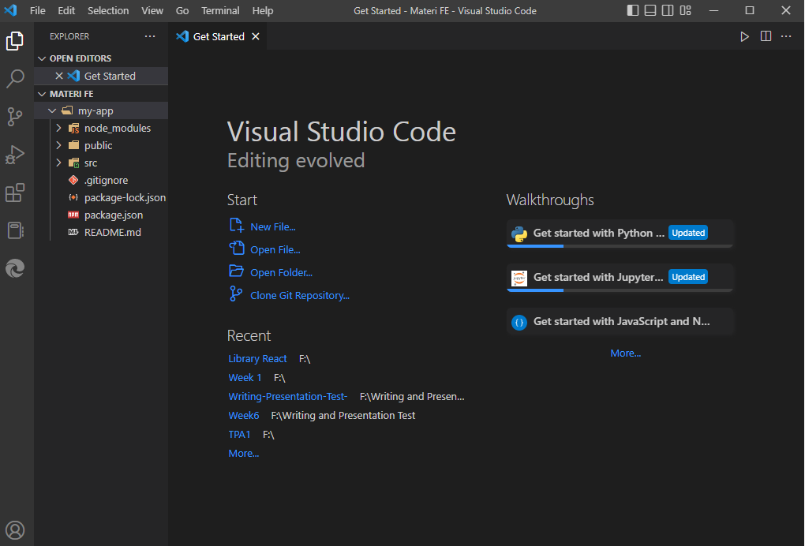
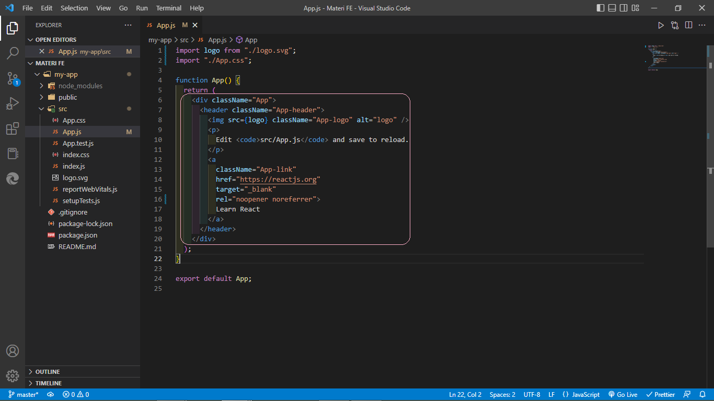
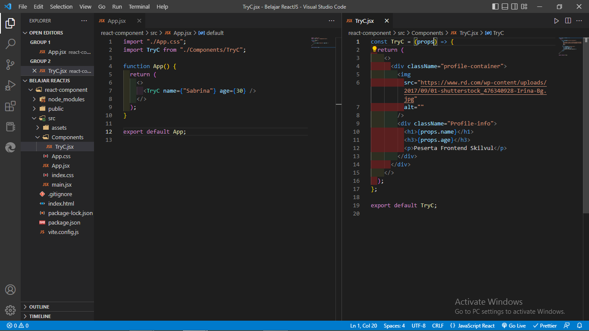
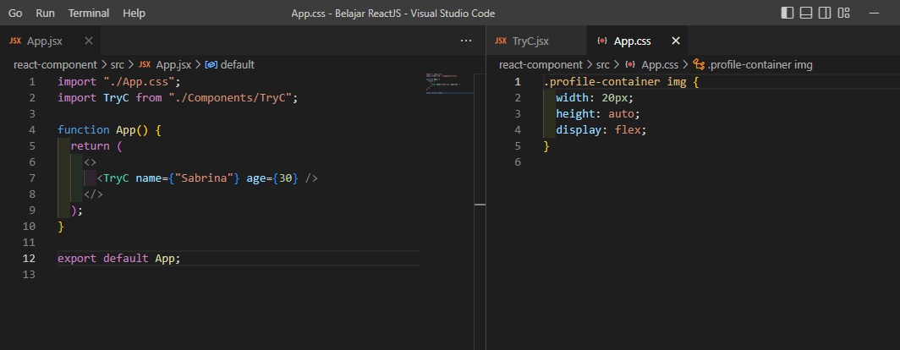
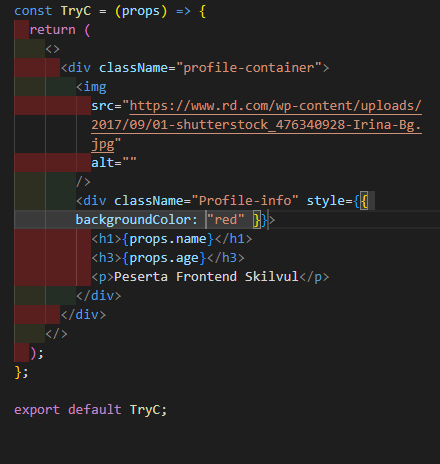

# Writing Test Week 1 Front-end Bootcamp

<center> Topik Materi : React </center>

<br/>
<br/>

## **Intro To ReactJS**

- ReactJS adalah Javascript library untuk membuat user interface, yang memiliki sifat single page application dan memiliki arsitektur berupa component based.

`React dikembangkan oleh tim engineer facebook`

- Salah satu keuntungan menggunakan react adalah proses yang lebih efesien dan cepat dibandingkan menggunakan DOM

- Library dapat berjalan menggunakan sebuah engine yaitu, **Node.js**

- Node.js dapat dibuat menggunakan _NPM_ atau menggunakan _Yarn_

- Untuk menginstall react menggunakan NPM dapat menuliskan sintaks

  ```
  npx create-react-app my-app
  ```

- Dengan menggunakan react kita hanya menjalankan file html di satu page,kerena react memiliki sifat Single Page Application

- React juga memiliki arsitektur berupa component based yang artinya, _reusable component_ atau component yang dapat digunakan berulang kali

- React berinteraski dengan DOM menggunakan **Virtual DOM** seperti perantara dengan DOM asli

- Virtual DOM sendiri diibaratkan seperti replika dari DOM yang asli, jika ada perubahan Virtual DOM hanya akan merubah di komponen yang diubah berbeda dengan DOM dia akan merubah satu halaman.

- Contoh folder react ketika sudah terinstall

  

- Dengan React kita dapat menuliskan sintaks HTML didalam Javascript.

`File ekstensi Javascript pada react adalah .jsx`

- Kita dapat menuliskan HTML didalam file App.js, dimana return hanya dapat mengembalikan 1 element. Disaat membutuhkan lebih dari 1 element untuk di return maka dapat membuat file baru dengan ekstensi .js lalu di export default

  

---

<br>

<center> Topik Materi : Component dan Styling di Dalam React </center>

<br/>
<br/>

- Component adalah salah satu cara untuk membagi UI kedalam satuan kecil

- Component pada reactjs berfisat reusable code, jadi dapat digunakan berulang kali sesuai dengan kebutuhan dalam mengembangkan sebuah product.

- Dalam react penamaan nama file disarankan untuk menggunakan kapital pada huruf pertama

  - contohnya **H**ome

<br>

- React menggunakan **ClassName** sebagai penanda bahwa element mempunyai class

- Satu component hanya dapat melakukan render pada 1 element, jika element yang ada lebih dari satu harus menggunakan pembungkus berupa tag kosong <></> atau tag div.

- Semua code yang telah dibuat akan tampil jika telah dimasukan ke dalam file APP.js ( Seperti pintu masuk untuk tampil di browser )

- Untuk memudahkan reusable code

  - Dapat membuat folder baru didalam folder src, dengan nama Components

  - Lalu buat file .jsx

  - Setelah menuliskan serangkaian code, jangan lupa untuk export default

  - Setelah itu import file di App.js agar code dapat ditampilkan kedalam browser

### Props & State

- props adalah data yang diberikan kepada child ( mirip seperti atribut )

- Props dapat diartikan sebagai perantara antara parent dan child

- Contoh penggunaan props

  

- State adalah data yang ada di dalam component

- Didalam React ada namanya useState ( cara menyimpan variable )

  ```
  const [name,setName] = useState('Sabrina')
  ```

- Disarankan menggunakan useState saat data yang digunakan bersifat dinamis agar perubahan tidak hanya pada value

### Styling CSS

<br>

- Sama halnya seperti menggunakan CSS pada HTML, di react ada 3 cara untuk menyisipkan code CSS

  - External CSS ( Styling didalam file CSS )

  

  - Inline CSS

    

  - Internal

- Bisa juga menggunakan bootstrap dengan mengcopy script dan link kedalam file html pada folder react

---

<br>

<center> Topik Materi : Lifecycle </center>

<br>
<br>

- Lifecyle bisa diibaratkan seperti siklus hidup, jadi proses ini terjadi secara bertahap dan berjalan secara otomatis pada react component

- Dalam React component ada 3 hal yang terjadi

  - Mounting [Get Data ] ( dimana komponen muncul )

  - Updating ( disaat ada perubahan )

  - UnMounting ( Komponennya hilang )

- Render yaitu proses menampilkan data pada browser.

- Lalu ada yang namanya Hooks yaitu fitur yang dapat memudahkan functional component agar bisa menggunakan state dan lifecycle contohnya seperti penggunaan useState
