# Writing and Presentation Test Week 2

## <center> **Day - 1** </center>

<center> Topik Materi : Javascript Dasar ( Scope & Function ) </center>

<br/>
<br/>

## **Javascript Scope**

---

- Scope adalah cara dari sebuah variabel dapat diakses didalam code/ Program atau bisa dibilang suatu **Linkup Variabel**

- Dalam JS ada yang namanya Global scope dan Function scope.

- **Global Scope / Windows Scope** adalah variabel yang dapat diakses darimana saja, contohnya :

  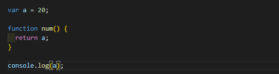

- **Function Scope** adalah variabel yang dideklarasikan menggunakan function hanya bisa diakses didalam function atau dengan kata lain adalah local scope, contohnya :

  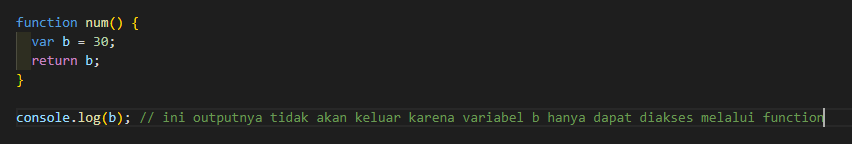

<br />

## **Javascript Function**

---

- Function diibaratkan suatu alat yang dapat kita isi dengan kondisi yang kita inginkan dan dapat menjalankan task yang diberikan

- Function bisa juga diartikan sebagai sub program yang dapat dipanggil di bagian lain pada program

- Function sendiri digunakan dan sangat berguna karena dapat menyembunyikan kompleksitas dari program yang kita buat selain itu function digunakan untuk mengurangi redudance blok kode.

- Sintaks Function

  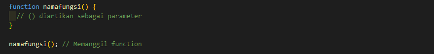

- Di Javascript ada yang namanya arrow function, yaitu bentuk lain untuk menuliskan sebuah function yang lebih ringkas menggunakan tanda =>

- Perbedaan keduanya tidak terlalu jauh hanya cara mendeklarasikan functionnya yang berbeda

  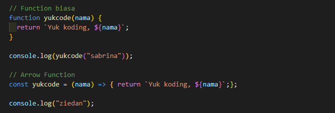

- Lalu ada _return_ digunakan untuk mengembalikan nilai

### **Parameter dan Argumen**

- Parameter adalah inputan data yang digunakan function dalam melakukan tasknya, Function sendiri dapat digunakan tanpa parameter.

- Argumen adalah nilai yang digunakan saat akan memanggil function.

  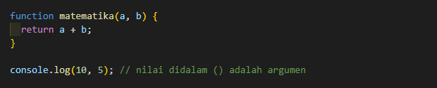

---

<br/>

## <center> **Day - 2** </center>

<center> Topik Materi : Data Type Built in Prototype & Method </center>

<br/>
<br/>

---

- Dalam javascript ada 2 jenis tipe data yaitu, primitive dan non primitive

- Javascript sendiri memiliki tipe data dengan bahasa pemograman yang cukup dinamis atau tidak memiliki aturan yang khusus

- Contoh tipe data primitive : Number, String, Boolean, Undefined, dan Null

- Contoh tipe data non-primitive : Array dan Object

- **Typeof** digunakan untuk mengecek sebuah tipe data

  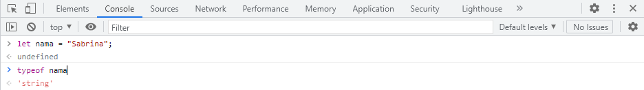

- Lalu pada tipe data ada yang dinamakan **properties** dan **method**.

  - properties adalah ciri-ciri yang dimiliki oleh sebuah tipe data

  - method diibaratkan sebagai sebuah keahlian dari sebuah tipe data / dengan artian lain method adalah sebuah function

### **A. String**

- String berguna untuk menyimpan data yang dapat direpresentasikan dalam bentuk teks

- Datanya dapat disimpan menggunakan ' ' ataupun " "

- String memiliki satu Properties dan banyak method

- [String Method and Properties](https://developer.mozilla.org/en-US/docs/Web/JavaScript/Reference/Global_Objects/String)

  - Properties string yaitu leght ( untuk mengetahui panjang karakter )

    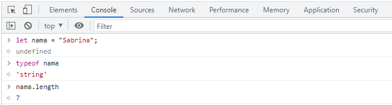

  - String memiliki banyak method yang dapat digunakan, contohnya :

    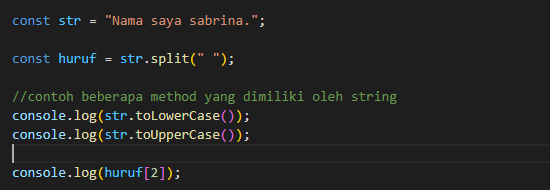

### **B. Number**

- Number menyimpan data berupa angka seperti 1, 100, 10000, 10.78

- [Number Method and Properties](https://developer.mozilla.org/en-US/docs/Web/JavaScript/Reference/Global_Objects/Number)

- Number memiliki beberapa method dan juga properties, contoh method number :

  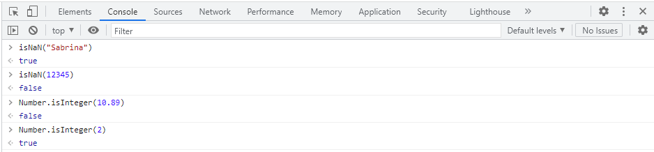

- isNAN digunakan untuk mengecek apakah value bukanlah sebuah number jika value number maka akan keluar false, jika bukan maka akan true

- isInteger digunakan untuk mengecek apakah value adalah sebuah integer.

### **C. Math**

- Math sudah disediakan oleh javascript untuk digunakan sebagai pengolah data number

- [Math Method and Properties](https://developer.mozilla.org/en-US/docs/Web/JavaScript/Reference/Global_Objects/Math)

- contoh beberapa properties dan method math

  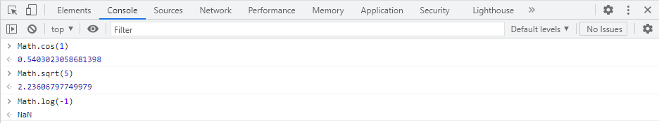

- _Math.cos_ digunakan untuk mengembalikan cos angka dalam radian, _Math.sqrt_ digunakan untuk mengembalikan akar kuadrat dari suatu bilangan, dan ada _Math.log_ digunakan untuk mengembalikan logaritma natural (basis e) dari suatu bilangan.

### **D. Object**

- Javascript object dapat menyimpan key and values yang kompleks

- Prototypes adalah mekanisme dimana JS object dapat menurunkan fiturnya

- [Javascript Object Method and Properties](https://developer.mozilla.org/en-US/docs/Web/JavaScript/Reference/Global_Objects/Object)

---

<br/>

## <center> **Day - 3** </center>

<center> Topik Materi : DOM </center>

<br/>
<br/>

---

- Document Object Model ( DOM ) adalah jembatan untuk bahasa pemograman agar dapat berinteraksi dengan dokumen HTML

- DOM dapat digunakan di berbagai bahasa pemograman, dan bukan bagian dari JS language.

- DOM bisa dibilang sebagai web API untuk membangun sebuah website agar lebih dinamis dan interaktif ( Programming Interface )

- Lalu ada Element dan Node, Elemen sendiri adalah bagian dari doc html misalnya seperti h1 ... h1 / div. Node adalah bagian terkecil dari struktur/document html (lebih detail) seperti teks, comment, dsb.

- Traversing halaman HTML menggunakan DOM

  - getElementById
  - getElementByClassName
  - getElemetByTagName
  - Children

  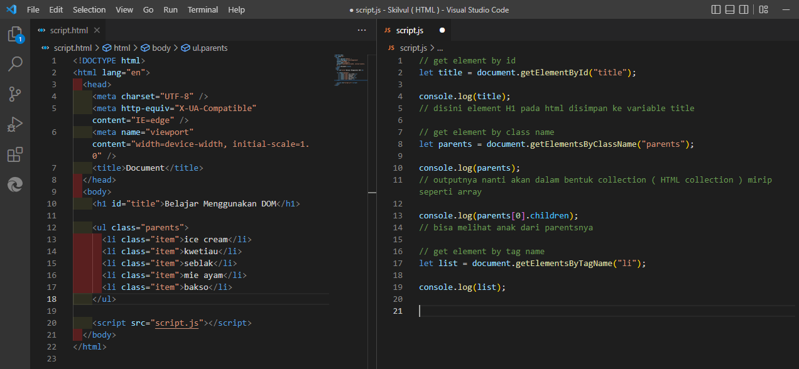

  - Query Selector Family

  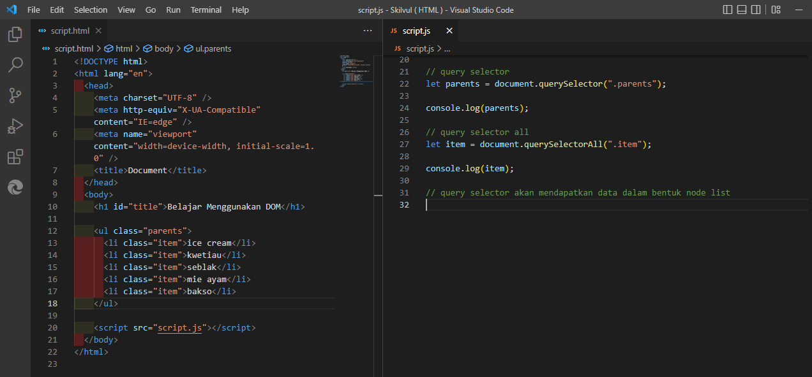

  - Menakses parent dan siblings

  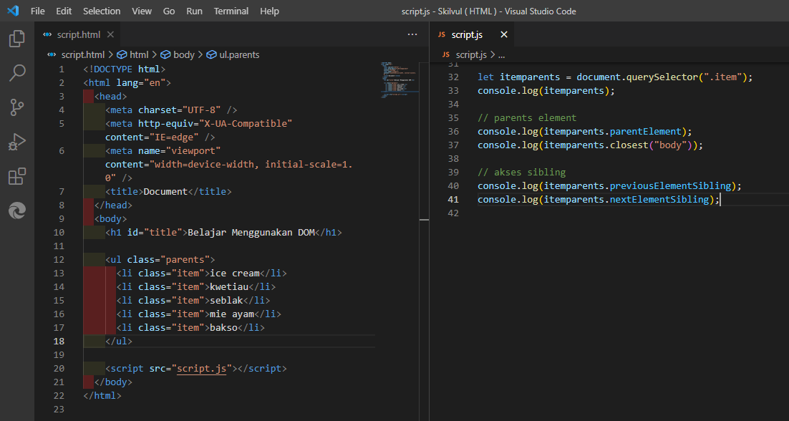

---

<br/>

## <center> **Day - 4** </center>

<center> Topik Materi : DOM Manipulation </center>

<br/>
<br/>

---

- Dengan bantuan javascript DOM mampu untuk melakukan manipulasi terhadap halaman HTML

- **innerhtml / innertext**

  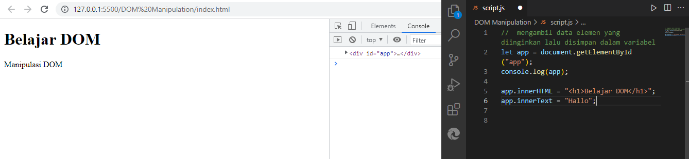

- Perbedaan antara keduanya adalah dimana innerhtml dapat melingkup ke seluruh doc html sementara innertext hanya menginput dalam bentuk teks

- **append atau appendchild**

- berfungsi saat ingin menginput child kedalam sebuah parents, dimana perbedaanya apped dapat menginput sebuah string sementara appendchild menginput object berupa node

  ```
  let app = document.getElementById("app");
  console.log(app);

  app.innerHTML = "<h1>Belajar DOM</h1>";

  let p = document.createElement("p");
  p.innerText = "Manipulasi DOM";

  app.append(p);

  seperti meminta ke DOM untuk memasukan elemen p kedalam elemen div
  ```

- **setAttribute(), getAttribute()**, menetapkan nilai baru ke sebuah atribut

- **style** menggunakan .backgroundcolor, .color, .padding, dan masih banyak lagi , digunakan untuk

  ```
  p.style.color = "red";
  p.style.padding = 30px;
  ```

- **remove** , digunakan untuk menghapus elemen

  ```
  let app = document.getElementById("app");
  p.remove();
  ```

---

<br/>

## <center> **Day - 5** </center>

<center> Topik Materi : DOM Events  </center>

<br/>
<br/>

## **Javascript DOM Events**

---

- Events adalah suatu interaksi antara user dan website, misalnya sebuah muncul pop-up

- Macam - macam Events

  - Focus
  - Submit
  - Blur
  - Hover
  - Change
  - dll

- Ada 3 cara menambahkan events

  - **Melalui Atribut HTML**

  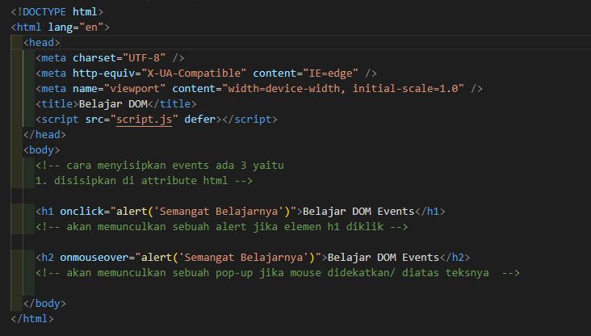

  - **Membuat Events Properties**

  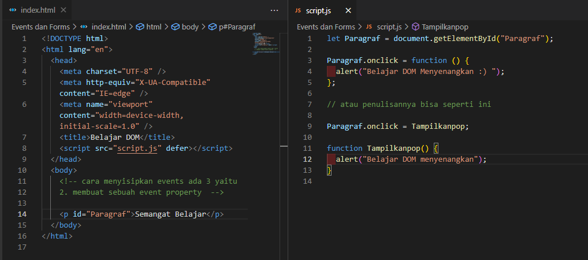

  - **Add Event Listener**

  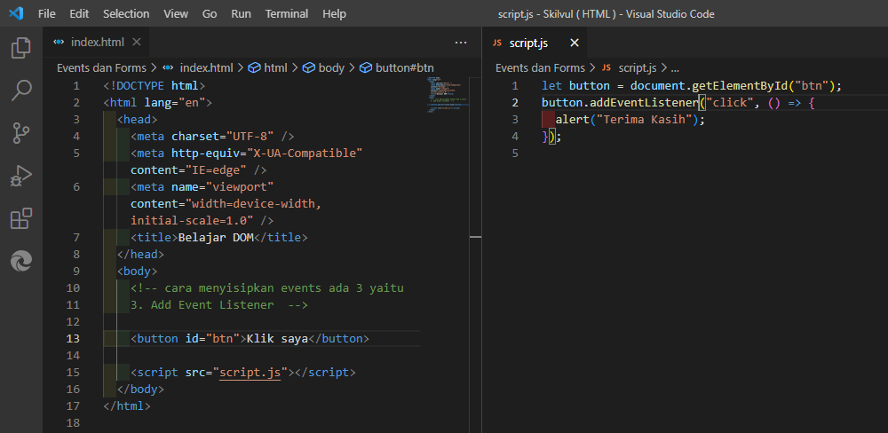

- Ada juga yang namanya multiple event, dimana satu element dapat diberika beberap events
