# Writing and Presentation Test Week 1

## <center> **Day - 1** </center>

<center> Topik Materi : Unix Command Line - Git & Github </center>

<br/>

## **Unix Command Line**

---

- Command line interface adalah program yang dapat menghubungkan user dengan sistem operasi
  - Command Line Interface = _Shell_ Berbasis Teks
- Shell adalah program yang dapat memberikan akses kepada user terhadap sistem operasi ( untuk menjalankan program ataupun melakukan konfigurasi )
- Akses tersebut diberikan dalam bentuk prompt/terminal dimana user dapat menuliskan perintah lalu akan diteruskan oleh sistem operasi
- Contoh basic shell pada windows adalah powershell dan command prompt ( CMD )

<center>
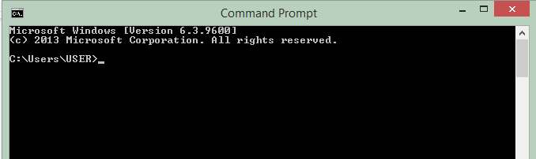
</center>

- File system Structure adalah bagaiman data disimpan dalam sebuah sistem

### **A. Command / Perintah**

- pwd ( print working directory ) command untuk melihat current working directory / untuk memperlihatkan dimana direktori yang sedang kita gunakan.

- mkdir ( make directory ) command untuk membuat sebuah directori baru.

- touch command untuk membuat file baru.

- cd ( change direktori ) command untuk berpindah direktori.

- ls ( list ) command untuk melihat isi dari sebuah direktori.

- ls -a command untuk melihat hidden direktori.

- head command untuk melihat isi dari sebuah file.

- cp ( copy ) command untuk menyalin sebuah file.

- cp -r command untuk menyalin sebuah direktori.

- mv ( move ) command untuk memindahkan file dan dapat digunakan juga untuk mengubah nama file / direktori.

- rm ( remove ) command untuk menghapus sebuah file.

- rm -r command untuk menghapus sebuah direktori.

</br>
</br>

## **Git & Github**

---

- Git adalah sebuah software yang dapat melakukan _Version Control System._

- Github adalah website untuk mengelola layanan Git.

- Version Control System ( VCS ) merupakan sistem yang dapat menyimpan dan mengelola rekaman perubahan dari source code.

> mengapa harus menggunakan Git atau Github &#10067;
>
> &#128640; alasan sederhana dari pertanyaan diatas adalah untuk mengurangi adanya duplikasi data yang tidak diinginkan serta berat dalam penyimpanan maka dari itu git atau github dapat mempermudah seseorang untuk bekerja dalam sebuah tim, dan bisa melacak siapa dan kapan terhadap perubahan yang terjadi pada suatu folder kerja yang dikerjakan secara bersama. Bukan hanya programmer, user diluar IT pun dapat menggunakan github karena sejatinya git dan github adalah 2 hal yang tidak perlu berjalan secara beiringan. Kita bisa menggunakan git tanpa github begitupun sebaliknya.

- Repository/Repo ( folder dalam github ) merupakan sebuah folder yang dapat mengelola file dengan system yang dapat menyimpan rekamanan perubahan. Riwayat perubahan tersebut disimpan menggunakan serangkaian _commit_

<br/>

### **A. Command Dasar**

- git init command ini dilakukan saat akan membuat repository baru

  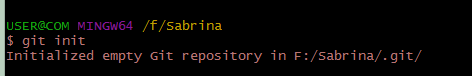

- git commit -m "pesan yang dapat ditambahkan untuk detail perubahan apa yang dilakukan". Command ini digunakan saat akan menyimpan perubahan yang telah dilakukan

  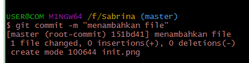

- git push -u origin command ini dilakukan saat akan mempublish file / aplikasi ke github

  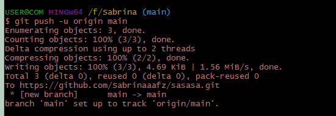

- git clone command ini digunakan saat akan mengcloning dari repository github ke local

  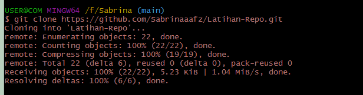

---

<br/>

## <center> **Day - 2** </center>

<center> Topik Materi : Hypertext Markup Language ( HTML ) </center>

<br/>

- **Definisi HTML**

  HTML ( Hypertext Markup Language ) merupakan bahasa yang digunakan untuk membuat kerangka atau struktur dari sebuah website. Peran utama html pada web development adalah dalam mengelola serangkaian data dan informasi sehingga suatu dokumen dapat diakses dan ditampilkan di Internet melalui layanan web.

- **Tools/Alat Pendukung Dalam Penggunaan HTML**

  - Text Editor, digunakan untuk menuliskan serangkaian code untuk menampilkan konten pada halaman web, contohnya seperti VScode, Sublime Text, Notepad, Notepad++ dan masih banyak lagi.

  - Perambanan Website, digunakan untuk menampilkan dan melihat konten yang dibuat, contohnya seperti Chrome, Mozilla, Firefox, dan masih banyak lagi.

- **Kerangka HTML Sederhana**

  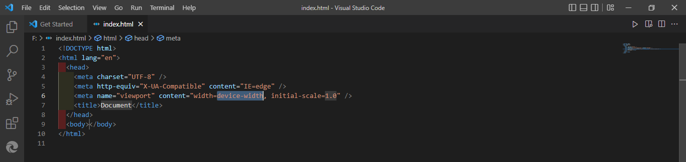

  Gambar diatas merupakan kerangka html dasar dengan beberapa tag yang ada didalamnya dari doctype lalu ada tag html ( menyimpan informasi meta ), head, dan body ( menyimpan konten yang akan ditampilkan )

- **Tag dalam HTML**

  Tag merupakan penanda awalan serta akhiran dari sebuah elemen html. Html sendiri memiliki banyak varian tag, dan html memiliki 2 jenis tag yaitu, ouble tag ( memiliki pembuka dan penutup) dan single tag ( tag yang tidak memiliki pasangan )

  - _Contoh Double Tag_

    - Tag Bold, Inline, dan Underline

      ```
      <b>Tebal</b> <i>Miring</i> <u>Underline</u>
      ```

      Tampilan pada browser :

      

    - Tag Anchor ( membuat tulisan dengan link )

      ```
      <a href="http://www.google.com"> Ayo Pergi Ke Google </a>
      ```

      Tampilan pada browser :

      

  - _Contoh Single Tag_

    ```
    tag <br> ( line break ) dan tag <hr> ( garis panjang )
    ```

    - Tag Image

      ```
      
      ```

      Tampilan pada browser :

      

- **Semantic Html**

  Semantic html adalah dimana elemen yang digunakan dapat mempresentasikan makna/ konten dari elemen tersebut, atau dalam kata lain elemen yang digunakan memang dikhususkan untuk penggunaanya misalnya elemen nav, header, footer.

- **Mendeploy Halaman Html**

  Deployment adalah tahapan dimana programmer mempublish website yang telah dibuat agar dapat dilihat oleh banyak orang, salah satu layanan untuk mendeploy halaman website adalah **netlify**.

---

<br/>

## <center> **Day - 3** </center>

<center> Topik Materi : Cascading Style Sheet ( CSS ) </center>

<br/>

- **Definisi CSS**

  CSS ( Cascading Style Sheet ) adalah bahasa komputer yang dapat memberikan style/ design pada halaman website agar dapat terlihat lebih baik dan menarik.

- **Cara Penggunaan CSS pada Html**

  - _Inline Style_

    Inline style adalah salah satu cara dimana kita dapat memasukan elemen css pada html. Biasanya penggunaan inline style hanya pada saat stuktrur konten yang relatif pendek. Inline style disisipkan langsung pada atribut html.

    ```
    <p style= "color:orchid" > Nama saya sabrina </p>
    ```

    akan memiliki output seperti dibawah ini :

    

  - _Internal Style_

    Internal style adalah cara lainnya dimana css dapat disisipkan kedalam html, biasanya penggunannya saat programmer ingin memisahkan antara elemen html dan elemen style css agar lebih mudah dibaca. Internal style dapat dituliskan pada atribut head dengan tag style

    ```
        <!DOCTYPE html>
    <html lang="en">
    <head>
        <meta charset="UTF-8">
        <meta http-equiv="X-UA-Compatible" content="IE=edge">
        <meta name="viewport" content="width=device-width, initial-scale=1.0">
        <title>Latihan CSS</title>

        <style>

    p {
        color:orchid;
    }

    </style>

    </head>
    <body>

    <p> Nama saya sabrina </p>

    </body>
    </html>
    ```

    Outputnya akan sama seperti style inline namun hanya cara penulisan kodenya yang berbeda

  - _Eksternal Style_

    Eksternal style adalah cara terakhir css dapat disisipkan kedalam html, penggunaanya disaat kode html yang kita miliki sangatlah banyak atau dalam pembuatan halaman website yang memiliki banyak konten, untuk memudahkan penulisan serta jadi lebih enak untuk dibaca, css akan memiliki file sendiri lalu nanti akan di sambungkan melalui tag link yang terletak pada tag head

    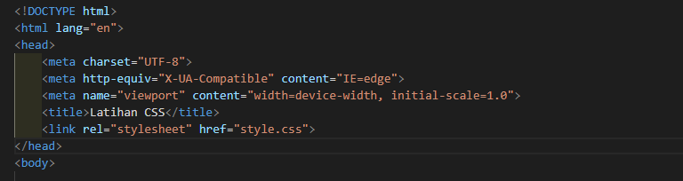

- **Sintaks Dasar CSS**

  CSS Sintaks adalah suatu sintaks yang digunakan untuk menunjuk atau memilih elemen pada html yang ingin diberikan style.

  ```
  p {
     color : orchid;
  }
  ```

  - P adalah selector dimana elemen yang dipilih untuk di berikan style adalah elemen P.

  - Color berperan sebagai property, dimana elemen P akan diberikan warna pada bagian teksnya.

  - Orchid adalah value, warna yang akan diberikan untuk elemen P adalah warna orchid.

- **Flexbox pada CSS**

  Flexbox adalah konsep pengaturan dimana kita bisa mengatur elemen atau tata letak secara fleksibel yang memungkinkan sebuah wadah elemen diatur secara otomatis tergantung pada ukuran area pandang.

---

<br/>

## <center> **Day - 4** </center>

<center> Topik Materi : Algorithm & Data Structure - Javascript Dasar  </center>

<br/>
<br/>

## **Algorithm & Data Structure**

---

- Algoritma adalah langkah - langkah terstruktur dalam penyelesaian suatu masalah.

- Data Structure adalah sebuah cara dalam mengatur data dengan memungkimkan berjalannya proses dan waktu yang digunakan secara efektif dan efesien.

> Apasih manfaat memahami Algorithm & Data Structure &#10067;
>
> &#128640; Dalam dunia pemograman, kita dituntut untuk dapat memahami sintaks/ code yang kita buat bukan hanya sekedar mengoperasikannya tapi paham akan fungsi dan kondisi pada code yang dituliskan. Dimana dengan pemahaman tentang algoritma dapat memudahkan kita dalam penyelesaian suatu masalah secara sistematis

### **A. Contoh Algoritma Sederhana**

- Menghitung luas segitiga

```
Analisis :

Input : a (alas) dan t (tinggi)
Luas Segitiga = a*t/2

Algoritma :

1. Masukan nilai alas (a) dan nilai tinggi segitiga (t)
2. Maka untuk menghitung luas digunakan rumus alas dengan tinggi yang sudah ditentukan
3. Rumus untuk menghitung Luas Segitiga yaitu L = 1/2*a*t
4. Nilai L (Luas) akan dicetak sebagai output ke perangkat output (keluaran)

```

### **B. Penyajian Algoritma**

- _Deskripsi_

  Menuliskan algoritma dengan rangkaian/ untaian kalimat deskriptif guna menyelesaikan suatu masalah menggunakan bahasa yang jelas.

- _Flowchart_

  Menuliskan algoritma dengan notasi grafis, yang dimana tahapan penyelesaian masalah di deskripsikan menggunakan bagan dan simbol.

- _Pseudocode_

  Menuliskan algoritma serupa dengan bahasa pemograman tinggat tinggi, yang umumnya notasi dalam bentuk lebih ringkas.

### **C. Jenis Algoritma**

- _Sequence_

  Menjalankan perintah / instruksi secara berurutan. Contohnya : Ambil Spidol - Buka tutupnya - Spidol bisa digunakan

- _Selection_

  Menjalankan instruksi jika salah satu kondisi terpenuhi. Contohnya : Jika banyak nyamuk, maka saya akan menyalakan obat nyamuk

- _Iteration_

  Menjalankan intruksi secara berulang selama suatu kondisi terpenuhi. Contohnya : Selama tugas saya belum selesai, saya akan terus mengerjakannya.

<br/>
<br/>

## **Javascript Dasar**

---

- Javascript adalah bahasa pemograman yang dapat membuat website agar lebih dinamis dan interaktif.

- Javascript dapat dijalankan melalui browser umumnya menggunakan mozilla atau chrome.

- Syntax dan Statement pada javascript, Syntax adalah bagaimana kita mengatur sebuah statement/ perintah pada program yang nanti akan dieksekusi oleh web browser dan compiler.
  - Contohnya seperti : Alert, Prompt, dll

<br/>

- Console log adalah tempat dimana kita melakukan pengecekan logic yang telah kita tuliskan

- Pada JS kita dapat memberikan comments / hidden text yang tidak akan dieksekusi dan tidak mengganggu code. Comments pada JS ada 2 jenis single comment dan multiline comments

  - Single comments : //
  - Multiline comments : /\* \*/

<br/>

- Variable pada Javascript diartikan sebagai wadah untuk menyimpan suatu nilai / data yang dapat kita gunakan sebagai penggambaran data tersebut, pada variable kita dapat melakukan manipulasi seperti mengupdate nilai yang disimpan. Javascript memiliki 3 cara untuk mendefinisikan variable

  - Var
  - Let
  - Const

### **A. Tipe Data Javascript**

- Number &#10147; tipe data berupa angka.

  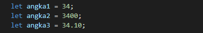

- String &#10147;Tipe data berupa grup karakter yang dapat menampung huruf, angka, simbol, dan spasi). Tipe data string harus diawali dengan single quotes ‘ … ‘ ataupun double quotes “ … “.

  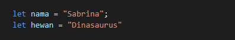

- Boolean &#10147; Tipe data true or false, dianalogikan seperti sebuah tombol ON or OFF jadi hanya memiliki 2 buah jawaban.

  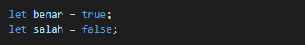

- Null &#10147; Tipe data yang diartikan sebagai kosong, artinya variable/dat yang ada tidak memiliki nilai outputnya akan berupa NULL

- Undefined &#10147; Tipe data yang mempresentasikan bahwa variable/ data adalah kosong atau tak terdefinisi, berbeda dengan NULL undefined adalah pernyataan disaat beberapa kondisi tidak terpenuhi misalnya Nilai dari parameter fungsi yang tidak memiliki argumen.

- Object &#10147; Tipe data ini dapat menampung string, number, boolean dan lainnya menggunakan key dan value

  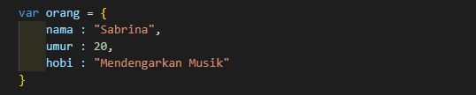

### **B. Tipe Operator Javascript**

- Assignment Operator ( = ) &#10147; Operator untuk menyimpan nilai pada variabel

  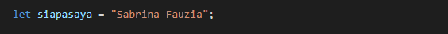

- Arithmetic Operator & Mathematical Operator &#10147; Operator yang digunakan untuk melakukan sejumlah perintah yang berkaitan dengan matematika

  - _Aritmetic Operator_

  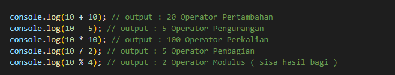

  - _Mathematical Operator_

  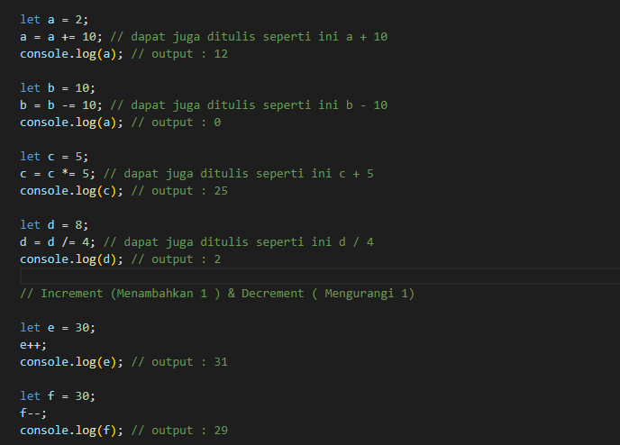

- Comparison Operator &#10147; Operator yang digunakan untuk melakukan perbandingan antara true or false

  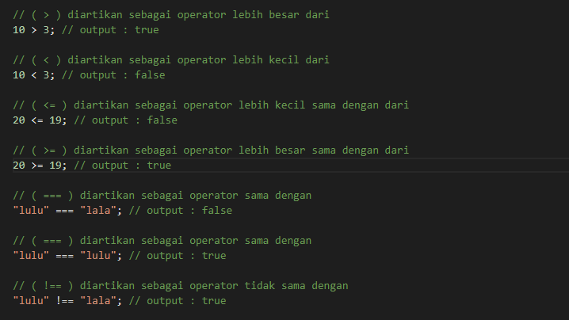

- Logical Operator &#10147; Operator yang digunakan untuk membandingkan suatu kondisi pada pemograman.

  ```
  ( && ) diartikan sebagai operator DAN yang jika kedua     kondisi/ Premis bernilai true

    true && true; // true
    false && true; // false

  ( || ) diartikan sebagai operator OR yang jika salah satu kondisi bernilai true

    false && true; // true
    false && false; // false

  ( ! ) diartikan sebagai operator NOT yang membalikan nilai dari Boolean, True = False begitu sebaliknya

    let happy = true;
    console.log(!happy); // false

    let happy = false;
    console.log(!happy); // true
  ```

---

<br/>

## <center> **Day - 5** </center>

<center> Topik Materi : Javascript Conditional & Looping  </center>

<br/>
<br/>

## **Javascript Conditional**

---

- Javascript conditional adalah sebuah penggambaran percabangan tentang suatu kondisi.

- Statementnya akan melakukan pengecekan pada kondisi yang diberikan lalu menjalankan perintah sesuai dengan kondisi yang diberikan.

- Jika kondisi dalam keadaan true maka code akan dijalankan.

### **A. Contoh Conditional**

- _IF statement_

  Penggunaan IF sama dengan penggunaan JIKA - MAKA contohnya, Jika hari ini hujan, Maka saya akan memakai payung.

  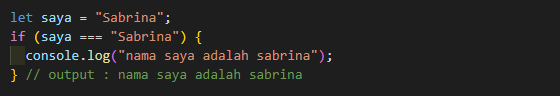

- _IF ELSE statement_

  Else akan mengeksekusi sebuah statement/code jika suatu kondisi tidak terpenuhi.

  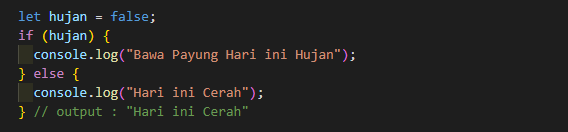

- _IF ELSE IF statement_

  Penggunaanya saat code memiliki lebih dari 2 kondisi / berbagai kondisi.

  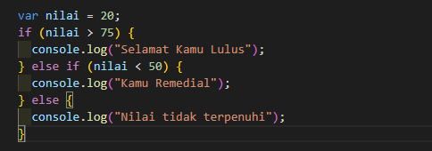

- _Switch Case_

  Switch Case digunakan pada saat kondisi percabangan terlalu banyak

  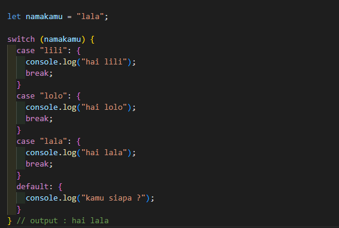

- _Ternary Operator_

  Merupakan bentuk short syntax dari statement if..else

  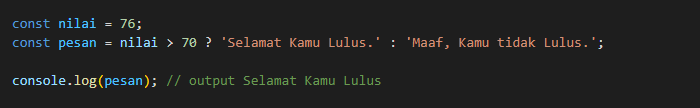

<br/>
<br/>

## **Javascript Looping**

---

- Javascript looping adalah statement yang digunakna untuk melakukan tugas berulang berdasarkan suatu kondisi.

### **A. Contoh Looping**

- _For Loop_

  For Loop digunakan saat statement memiliki kondisi awal dan akhir dari perulangan yang diinginkan

  ```
    for([inisialisasi]; [kondisi]; [eksekusi iterasi]) {
        // blok kode
    }
  ```

  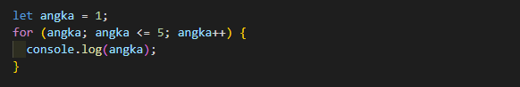

- _While Loop_

  While Loop digunakan saat akan menjalankan instruksi pengulangan kondisi bernilai true.

  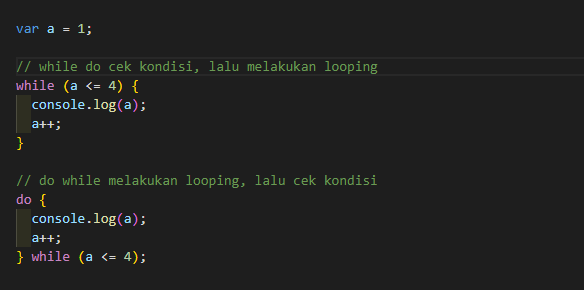

- _Nested Loop_

  Nested Loop digunakan saat akan melakukan looping didalam looping
