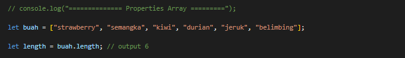

# Writing and Presentation Test Week 3

## <center> **Day - 1** </center>

<center> Topik Materi : Javascript Array </center>

<br/>
<br/>

## **Javascript Array**

---

- Javascript memiliki beberapa tipe data non-primitive salah satunya adalah **array**. Array adalah tipe data yang dapat menampung atau menyimpan banyak data dengan berbagai tipe data. Dengan kata lain array itu seperti wadah yang dapat menampung data yang kita inginkan.

- Contoh Array

  ```
  let Siswa = ["Budi", "Sabrina", "Sisil", "Aditya"]
  ```

- Sintaks diatas dibaca, Variabel Siswa menampung data dalam bentuk array betipe string, memiliki panjang 4, dan memiliki 3 index

- Didalam Array, data didalamnya dihitung dalam bentuk index, index array dimulai dari angka 0.

- Array sendiri memiliki beberapa properties dan method yang dapat digunakan,

**A. Properties Array**

- Untuk menambahkan data kedalam array dapat menggunakan _push_ atau _unshift_

  

- Untuk menghapus data didalam array dapat menggunakan _pop_ atau _shift_. Dapat juga menggunakan _splice_ jika ingin menghapus data yang spesifik

  

- Untuk mengetahui panjang dari sebuah array dapat menggunakan _lenght_

  

- Untuk mengambil ( mengcopy ) data dari array dan menaruh kedalam variabel baru, dapat menggunakan slice

  ```

    let buah = ["strawberry", "semangka", "kiwi", "durian", "jeruk", "belimbing"];

    let slice = buah.slice(2, 1); // 2 digunakan sebagai start index

    console.log(buah);
    console.log(slice); // outputnya akan

  ```

- Untuk mengubah data didalam array dapat menggunakan sintaks seperti dibawah ini

  

**B. Array + Loop**

- Array sendiri dapat digabungkan bersama loop

- Dapat menggunakan for of, foreach, dan bisa menggunakan maping

- Untuk maping sendiri dapat digunakan saat akan melakukan manipulasi, mengubah, mengupdate, mengembalikan nilai array.

  

**C. Array Multidimensi**

- Array multidimensi adalah dimana ada bagian kolom dan baris untuk mengakses data didalamnya

  

---

<br>

## <center> **Day - 2** </center>

<center> Topik Materi : Javascript Object </center>

<br/>
<br/>

## **Javascript Object**

---

- Javascript Object adalah tipe data non-primitive yang agak mirip seperti aray, tapi menampung data menggunakan key and value

  

- Ada 2 cara untuk mengakses data object

  - Menggunakan Dot Notation

    

  - Menggunakan Bracket Notation ( Kurung Kurawal/ Keriting)

- Untuk menambahkan data key dan value dalam object dapat menggunakan dot
  notation

  

- Untuk mengubah data object kita dapat menggunakan dot notation atau menggunakan kurung kotak

  

- Untuk menghapus data object kita dapat menggunakan delete dengan sintaks

  ```
  delete.namakey.namavalue
  ```

- Lalu ada method pada object digunakan untuk melakukan suatu tindakan yang dimana method pada object berisikan function

  

- Ada Nested Object, dimana object memiliki data bercabang

  

- ArrayofObject, Dua tipe data non-primitive yang dapat digunakan secara bersamaan, atau kita dapat menyimpan object didalam sebuah array.

  

---

<br>

## <center> **Day - 3** </center>

<center> Topik Materi : Javascript Module dan Recrusive</center>

<br/>
<br/>

## **Javascript Module**

---

- Javascript module adalah cara untuk memisahkan kodeke file yang berbeda

- JS module memiliki beberapa keuntungan dimana kita dapat dengan mudah untuk mengelola kode agar tidak menumpuk didalam satu file.

- Didalam module ada istilah import dan export dimana digunakan sebagai alat untuk mengambil dan mengirim data ke file yang berbeda

- Main file pada JS module hanya dapat menggunakan import, dengan menambahkan type berupa module didalam script file mainfile.js

  ```

  Sintaks untuk menggunakan module

      <!DOCTYPE html>
      <html lang="en">
      <head>
          <meta charset="UTF-8" />
          <meta http-equiv="X-UA-Compatible" content="IE=edge" />
          <meta name="viewport" content="width=device-width, initial-scale=1.0" />
          <title>Document</title>
      </head>
      <body>
          <!-- file yang ada disini cuma bisa melakukan import -->
          <!-- menambahkan type modul pada script utama  -->

          <script src="main.js" type="module"></script>
      </body>
      </html>

  ```

- Selanjutnya ada export yaitu membuat suatu file.js (file baru) yang nantinya akan di import/dijalankan di file lain

- Sintaks untuk melakukan export

  ```

  export Handphone = ["Iphone", "Samsung", "Oppo", "Asus"]

  ```

- Kata kunci **export** diperlukan untuk dapat melakukan export pada suatu file

- Dengan sintaks diatas kita dapat membuat sebuah file baru untuk menjalankannya, contohnya sintaks untuk di file main.js

  ```

  import {Handphone} from "./file.js";

  console.log(Handphone)

  ```

- Bisa juga menggunakan **as** untuk mengubah nama object

  ```

  import {Handphone as HP} from "./file.js";

  console.log(HP)

  ```

- Bisa juga menggunakan splice untuk memanipulasi data dari file export

  ```

  import {Handphone as HP} from "./file.js";

  console.log(HP)

  HP.splice[1,1]

  ```

- Import sendiri dapat menangkap banyak export

<br />

## **Javascript Recrusive**

---

- Recrusive adalah algoritma yang memanggil diri dia sendiri (Function yang memanggil function itu sendiri)

- Recrusive bisa digunakan sebagai pengganti perulangan(looping)

- Recrusive biasanya digunakan untuk perhitungan matematika yang cukup rumit

- Recrusive adalah bagian dari paradigma pemograman

- Implementasi pada permasalahannya itu seperti kita memiliki masalah besar, lalu masalah itu dipecahkan dari hal" yang paling kecil. Jika masalah paling kecilnya sudah selesai maka secara tidak langsung masalah" lainnya ikut terpecahkan

- Kunci dari recrusive ada 2 yaitu

  - Base case ( Titik paling kecil (berhenti) )

    ```

    if (n == 1) {
        console.log(n)
    }

    console.log(1)

    ```

  - Recrusion case (Titik dimana dia memanggil diri dia sendiri)

    ```

        if (n == 1) {
            console.log(n)
        }else {
            deretAngka(n-1)
            console.log(n)
        }

        console.log(2)

    ```

- Penggambaran Rescrusion case ada maka penggambaran penyelesaian masalahnya seperti ini

  

---

<br>

## <center> **Day - 4** </center>

<center> Topik Materi : Javascript Asynchronous</center>

<br/>
<br/>

## **Javascript Asynchronous**

---

- Asynchronous seperti melakukan proses yang tidak berurutan

- Javascript sendiri memiliki fitur asynchronous yang dapat digunakan untuk meningkatkan User experience itu sendiri, dimana kita dapat melakukan hal lain saat menunggu loading pada suatu halaman

- Javascript merupakan bahasa yang memiliki ciri single-thread, non-blocking, dan asynchronous

- Asynchronous sendiri memiliki 3 kunci utama yaitu, Callback, Promises, dan Async Await.

- Contoh sintaks untuk asynchronous menggunakan setTimeout (Bagian dari web API)

  

**A. Promise**

- Lalu ada Promise yang dapat digunakan untuk mengetahui adanya 3 hal penting yaitu pending, rejected, dan fulfilled pada sebuah proses

- Pending seperti proses yang sedang dijalankan namun membutuhkan waktu sampai tercapai

- Rejected adalah dimana proses tersebut dicancel atau terputus ditengah prosesnya sedang berjalan

- Fulfilled adalah disaat proses yang sedang dijalankan sudah tercapai

- Dalam proses promise ada yang namanya resolve ( saat proses berhasil, akan ditangkap menggunakan .then ) dan rejected (saat proses gagal akan ditangkap menggunakan .catch)

  

---

<br>

## <center> **Day - 5** </center>

<center> Topik Materi : Web Storage</center>

<br/>
<br/>

## **Web Storage**

---

- Browser memiliki ruang penyimpanannya sendiri yang digunakan untuk menyimpan data secara lokal dari users browser

- Web storage sendiri seperti versi upgrade dari cookies dimana penyimpanan yang lebih besar dan lebih unggul.

- Javascript sendiri dapat berinteraksi dengan web storage menggunkan WEB API (seperti jembatan)

- Web storage ada dua jenis penyimpanan

  - Local Storage, tidak memiliki batas waktu penyimpanan

  - Session Storage, hanya disimpan diwaktu itu saja, jika tab ditutup maka data akan hilang

- Di web storage sendiri kita bisa membuat seperti, fitur dark mode, detail page, to do list dan masih banyak lagi
