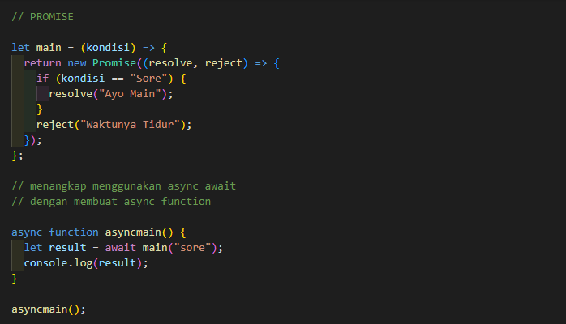
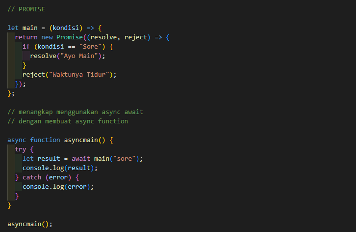
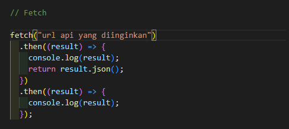

# Writing and Presentation Test Week 4

## <center> **Day - 1** </center>

<center> Topik Materi : Asynchronous Fetch & Asynchronous Async - Await </center>

<br/>

## **Asynchronous Async - Await**

---

- Website dinamis membutuhkan sebuah server yang dapat melakukan manipulasi data, dalam berinterkasi dengan server dibutuhkannya API sebagai jembatan

- Data yang diterima biasanya dalam bentuk JSON (Javascript Object Notation) => data mirip seperti object yang diapit dengan kutip " "

- Salah satu cara untuk menggunakan/ menangkap object promise adalah menggunakan async - await. Berbeda dengan promise biasa yang menagkap object dengan .then - .catch, Async-await mengangkap object promise menggunakan function

- Async await merupakan fitur yang hadir sejak ES2017 bekerja dengan cara menunda eksekusi hingga proses asynchronous selesai

- Function yang menggunakan async await harus disertai kata kunci async, dan await hanya bisa digunakan jika function dalam bentuk async

  

- Async await menangkap error menggunakan try catch, dimana akan dijalankan dulu code async functionnya (try) dengan lalu jika error akan ditangkap menggunakan catch

  

<br/>

## **Asynchronous Fetch**

---

- Fetch adalah object promise yang sudah disediakan oleh Javascript

- cara menagkap object promise menggunakan fetch sama dengan diatas, bisa menggunakan .then - .catch atau menggunakan async await

  

  - menggunakan async await

  ```
    let getdataapi = async () => {
        let response = await fetch ("url api")
        let result = await response.json()
        console.log(result);
    }

    getdataapi()
  ```

- JSON adalah method yang dimiliki oleh Fetch

- Data yang ditangkap nantinya akan dalam bentuk array

---

<br>

## <center> **Day - 2** </center>

<center> Topik Materi : Git dan Github Lanjutan</center>

<br/>
<br/>

## **Git dan Github Lanjutan**

---

- Dengan menggunakan github kita dapat bekerja secara berkolaborasi, biasanya dalam pembuatan sebuah website yang melibatkan beberapa orang per-orang akan mengerjakan satu fitur dengan branch masing-masing yang nantinya akan di combine di main branch

- Github sendiri dapat memudahkan kita dalam berkolaborasi dengan memantau semua perubahan yang ada

- Di Github dapat menggunakan akun github organisasi, agar dapat bekerja berkolaborasi

- Repository nantinya dapat dibuat beberapa cabang (branch) untuk memisahkan satu pekerjaan dan pekerjaan lainnya

- Biasanya dalam berkolaborasi akan ada branch utama ( Main Branch ), digunakan hanya untuk perubahan yang telah fixed ( tahap production, sudah di publish )

- Lalu dibuat branch ke 2 (secondary branch ) yaitu branch development, dari branch dev nanti akan bercabang ke branch sesuai dengan pekerjaan masing2 jadi tiap individu memiliki branch masing2. Digunakan untuk menampung branch2 yang ada

- Pull Request, digunakan untuk menggabung branch individu ke branch dev

- Merge, dimana permintaan pull request sudah disetujui oleh team leader ( Menggabungkan )

- Setiap Push perubahan pastikan untuk selalu pull request ke branch diatasnya agar perubahan masuk ke branch development.

- Conflict, terjadi karena adanya 2 orang yang memanipulasi branch yang sama

- Cara menangani conflict bisa dengan merge terlebih dahulu perubahan terbaru, lalu memilih perubahan yang diinginkan.

---

<br>

## <center> **Day - 3** </center>

<center> Topik Materi : Responsive Web Design & Bootstrap </center>

<br/>
<br/>

## **Responsive Web Design**

---

- Responsive Web Design adalah salah satu cara agar tampilan website yang dibuat dapat menyesuaikan device yang digunakan.

- Ada beberapa cara untuk mengatur responsive terhadap website

  - View Port => Menggunakan meta viewport
  - Max - Width => Memberikan ukuran content yang menyesuaikan ukuran layar
  - Media Query => contoh penerapan media query @media screen and (max-width: 900px)
  - Relative Unit => menyesuaikan ukuran dengan ( vh, vw, em, rem, %)
  - Flex membuat content lebih efisien untuk diatur
  - Grid, sistem yang dapat mengatur content secara luas (atas, bawah, kanan, kiri )

- Terdapat 3 jenis breakpoint yaitu desktop, tablet, dan mobile phone

- Breakpoint adalah patahan dimana tampilan website akan mengubah dan menyesuaikan besaran device dengan bentuk yang telah diatur

<br/>

## **Bootstrap**

---

- Bootstrap adalah salah satu framework yang menyediakan berbagai style CSS untuk kebutuhan development (Sudah Responsive)

- Bootstrap dikembangkan oleh twitter ( Mark Otto, Jacob Thornton )

- Bootstrap dapat dikonfigurasi dengan cara meletakan tag bootstrap di tag head, lalu memanggil css bootstrap menggunakan href lalu mengganti link href css lokal dengan link boostrap online.

- Bootstrap memiliki style yang sudah responsive

- Di dalam bootstrap ada yang namanya container, Container adalah blok dasar atau pembungkus boostrap yang terdiri dari contain, pad dan align

- Terdapat 3 container pada boostrap yaitu :

  - container, yang menerapkan lebar maksimum pada setiap breakpoint responsif
  - container-{breakpoint}, menerapkan lebar 100% sampai dengan breakpoint yang ditentukan.
  - container-fluid, menerapkan 100% ukurannya dari breakpoints

- Grid System pada bootstrap yang terdiri dari 12 kolom default

- Grid system bootstrap :
  - col-lg digunakan untuk mengatur grid pada ukuran monitor yang besar
  - col-md digunakan pada monitor komputer berukuran sedang
  - col-sm digunakan untuk mengatur monitor pada tablet
  - col-xs digunakan untuk mengatur monitor pada handphone
